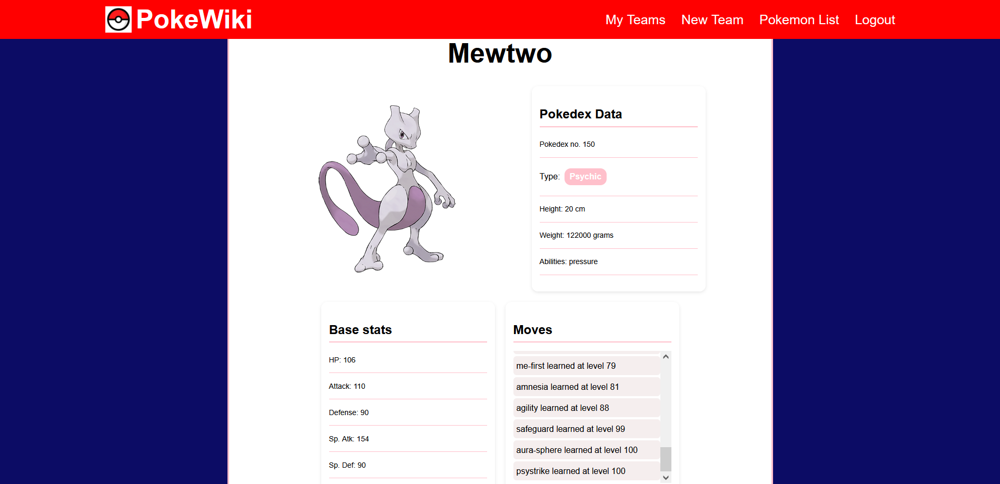

<h1>DESCRIPTION</h1> 

PokeWiki is a website made for the Pokemon community where they can check a list of Pokemons, create a team of 6 Pokemons, edit or even delete the team. 
Each Pokemon have his own list of movelist, Pokedex Data, and Base Stats. 
For example, this is Mewtwo's page: 

<h1>Attributions</h1>

The followings are everything that has been used to complete the project as an outside sources:

<ul>
<li><a href="https://www.w3schools.com/">W3Schools</li>
<li><a href="https://developer.mozilla.org/en-US/">PokeApi API</li>
<li><a href="https://github.com/GA-SEB-8/JWT-Auth-Frontend">GA Authentication Lesson</li>
<li><a href="https://github.com/GA-SEB-8/pets-frontend">GA Frontend Example </li>
<li><a href="https://github.com/GA-SEB-8/Pets-backend">GA Backend Example</li>
<li><a href="https://4kwallpapers.com/images/wallpapers/pokemon-go-5k-black-1920x1080-21680.png">Pokemon Image</li>
<li><a href="https://encrypted-tbn0.gstatic.com/images?q=tbn:ANd9GcTtuLvq_z6fGcatFZVwO9KBw03rgVetQA-p9Q&s">Pokemon Icon</li>

</ul>

<h1>Project's Technological Content</h1>

The website's main technology that have been used is REACT for the front-end and MEN Stack for the back-end. REACT is the core of the website as it is took care of the user interface with a combination of components to structure the website such as NavBar, PokemonList, PokemonDetails...etc. 
In order to make the website function as a full CRUD (create, read, update, and delete), it was linked and combined with MongoDB which allowed to store all data related to the Pokemon team, username, and a password for each user.
 

 

In addition, CSS has been implemented to design and make changes to the website. For example, one of the techiques that have been used is 
whenever the user hovers on any of the NavBar options, the option will change color. Overall, css have been use to make the website look decently and related to Pokemon. 

 

<h1>Improvements for The Future</h1>

The website can be improved a lot from it's current state and here are some examples: 

<ul>
  <li>Add Movelist Selection option</li>
  <li>Movelist Description</li>
  <li>Add comment feature for the teams</li>
  <li>Allow users to view other users teams</li>
</ul>
